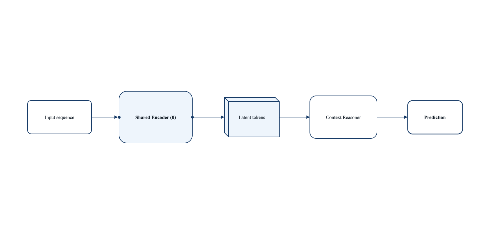
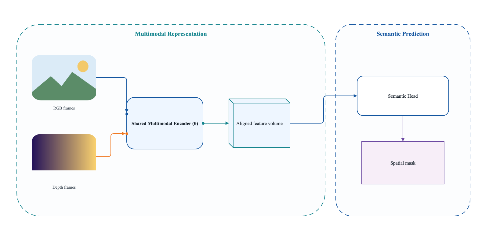
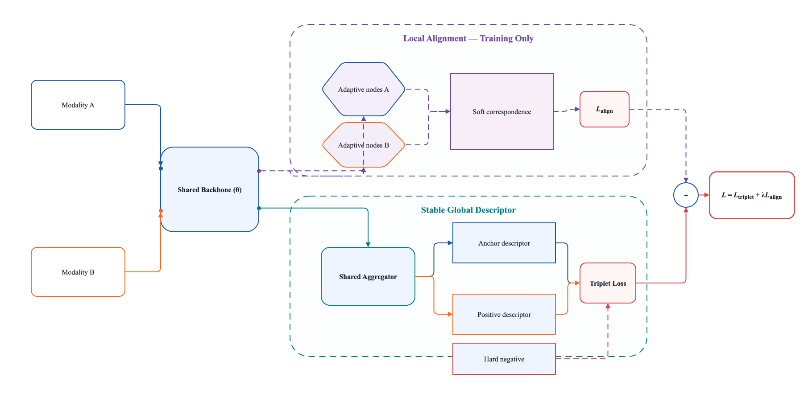

# Academic Framework Figure v2

Create editable, publication-quality academic method figures in draw.io, then validate and export them deterministically. Version 2 is informed by coded observations from 60 accepted papers across 15 conference-year groups; the repository contains metadata and original examples, never copied paper figures.

## Three styles

| Style | Best for | Original preview |
|---|---|---|
| `minimal-modular` | One main path, few modules, large whitespace |  |
| `visual-semantic` | Real inputs, multimodal lanes, tensors, masks, semantic examples |  |
| `structured-pipeline` | Multiple branches/losses, stage panels, training/inference separation |  |

Automatic routing selects `structured-pipeline` for complex branching or train/test separation, `visual-semantic` when images or modalities dominate, and `minimal-modular` otherwise. An explicit user choice always wins.

The same routing rule is available from the command line:

```bash
SKILL=plugins/academic-framework-figure/skills/academic-framework-figure
python3 "$SKILL/scripts/route_style.py" \
  --branches 2 --losses 1 --real-image-ratio 0.55 --modalities 2
```

Use `--train-test-split` when the figure separates training and inference. The command prints exactly one of the three style names.

## Install as a Codex Plugin

```bash
git clone https://github.com/Brandon030722/academic-framework-figure.git
cd academic-framework-figure
codex plugin marketplace add "$PWD"
codex plugin add academic-framework-figure@academic-framework-figure
```

Start a new Codex task, then invoke:

```text
$academic-framework-figure
```

## Install only the Skill

```bash
git clone https://github.com/Brandon030722/academic-framework-figure.git
mkdir -p ~/.codex/skills
cp -R academic-framework-figure/plugins/academic-framework-figure/skills/academic-framework-figure ~/.codex/skills/
```

The Skill is self-contained: scripts, references, 60-paper evidence metadata, icons, and three editable templates live under the same directory.

## Generate from a spec

```bash
SKILL=plugins/academic-framework-figure/skills/academic-framework-figure
node "$SKILL/scripts/generate_figure.js" \
  --spec examples/visual-semantic/spec.json \
  --out build/framework.drawio
```

`figure-spec.json` describes the canvas, style, font, groups, nodes, ports, embedded images, orthogonal edges, singleton shared modules, forbidden labels, and expected outputs. See `references/figure-spec.md` and `figure-spec.schema.json` inside the Skill.

## Validate and render

Public validation requires only Python 3 and Node.js; it does not require PyYAML.

```bash
SKILL=plugins/academic-framework-figure/skills/academic-framework-figure

python3 "$SKILL/scripts/validate_skill.py" "$SKILL"
python3 research/validate_corpus.py
python3 scripts/validate_plugin.py plugins/academic-framework-figure \
  --marketplace .agents/plugins/marketplace.json
python3 -m unittest discover -s tests -v
```

Validate an editable figure:

```bash
python3 "$SKILL/scripts/validate_drawio.py" build/framework.drawio \
  --require-font "Times New Roman" \
  --forbid-external-images \
  --expect "Shared Encoder (θ)=1"
```

Export and run the full QA pass with the draw.io desktop app installed:

```bash
python3 "$SKILL/scripts/qa_figure.py" build/framework.drawio \
  --out-dir build/framework-exports
```

The renderer checks `DRAWIO_BIN`, the system `PATH`, and common macOS, Windows, and Linux locations. It creates a PNG, a single-page PDF, and a 25% thumbnail.

## Repository layout

```text
.agents/plugins/marketplace.json       Codex marketplace
plugins/academic-framework-figure/    Codex Plugin 2.0.0
  .codex-plugin/plugin.json
  skills/academic-framework-figure/   Standalone Skill
examples/                              Three original spec/draw.io/PNG/PDF sets
research/papers.json                  60-paper coded evidence corpus
tests/                                Generator and XML failure-mode tests
```

## Research and copyright policy

Each public corpus record contains an official acceptance/proceedings link, a paper/PDF link, the primary figure/page, layout measurements, train/inference and shared-parameter encodings, and an inspection checklist. The repository does not redistribute paper screenshots, figures, conference logos, or user project assets.

Paper-specific material such as CRAFT inputs should stay in the user's local project. Only assets with redistribution permission may be embedded in a public template.

## License

MIT
